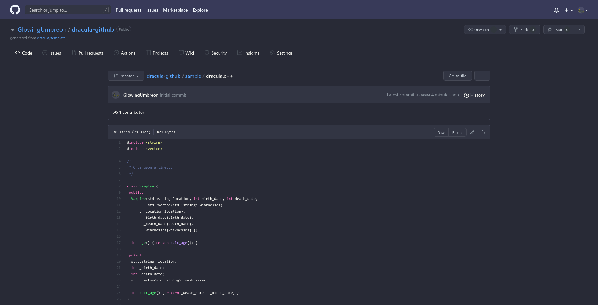

# Dracula for [Github](https://github.com)

> A dark theme for [Github](https://github.com).

## Install

All instructions can be found at [draculatheme.com/github](https://draculatheme.com/github).

## Team

This theme is maintained by the following person(s) and a bunch of
[awesome contributors](https://github.com/dracula/github/graphs/contributors).

|  |  |
| ----------------------------------------------------------------------------------------------- | ----------------------------------------------------------------------------------------------- |
| [Umbreon](https://github.com/GlowingUmbreon)                                                    | [asportnoy](https://github.com/asportnoy)                                                       |

## Community

-   [Twitter](https://twitter.com/draculatheme) - Best for getting updates about themes and new
    stuff.
-   [GitHub](https://github.com/dracula/dracula-theme/discussions) - Best for asking questions and
    discussing issues.
-   [Discord](https://draculatheme.com/discord-invite) - Best for hanging out with the community.

## License

[MIT License](./LICENSE)
